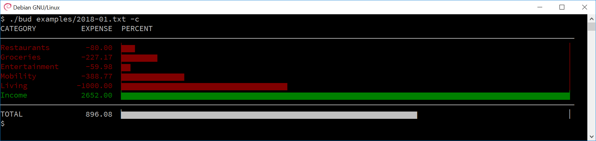

# Bud

Bud generates reports of plaintext budget files.
They aim to support you in understanding how much you spent in each category and how much money you have left each month.

## Plaintext Budget Files

Plaintext budget files are a human readable log of all expenses filed under multiple categories.
They can be written in any text editor and preprocessed with many existing commandline applications.
Moreover, they can be nicely managed and archived with version control systems, e.g., [subversion](https://subversion.apache.org), [git](https://git-scm.com/), and [Mercurial](https://www.mercurial-scm.org).

The following shows an example of a plaintext budget file for one month.
Each line is one expense and contains a day, a category, an expense, and a comment field.
Expenses that do not belong to a specific day can be set to day `00`.
Day and category should not contain any whitespace.
The name of the category and the text in the comment field can be freely chosen.
The expense should use a dot to separate cents (format: `[-][0-9]+.[0-9][0-9]`).
There is no currency support. Just use your main currency and stick to it.

    00  Income          2500.00         Main job
    00  Income           100.00         Side job
    00  Living         -1000.00         Rent
    00  Mobility        -300.00         Car
    00  Entertainment     -9.99         Music streamings
    05  Groceries        -51.33         Whole Foods
    01  Mobility         -24.77         Gasoline
    11  Groceries        -35.91         Whole Foods
    19  Groceries        -75.86         Whole Foods
    21  Restaurants      -34.00         Steakhouse
    21  Mobility         -33.00         Gasoline

You can find more examples under `examples/` in the repository.

Noteworthy, you do not have to organize your plaintext budget files as months.
You can also keep different files for different purposes, e.g., personal, business, hobbies, or shared budgets.
The day category supports full dates as long as they do not include any whitespace (e.g., 2018-04-21).
Just experiment around to find the best usage of it for your life.

## Install

It is recommended to compile *Bud* by invoking `make` in the main directory.
Compilation was tested under Debian with gcc 6.3.

A restricted version of *Bud* also works directly under Windows (tested on Windows 10 with gcc 7.2).
At the moment, the Windows version does not support colors and has no unicode output.
For compilation, please install [mingw-w64](http://mingw-w64.org) and compile with `mingw32-make.exe`.

The executable will be created in the main directory and is named `bud.exe` on Windows and otherwise `bud`.

## Usage

The easiest way to use *Bud* is by passing a file directly:

    bud [--inverse] [--noheader] [--color] [--nochart] [--nototal] <FILE>

As an alternative way, you can pass the data using a pipeline, e.g.:

    cat <FILES> | bud [--inverse] [--noheader] [--color] [--nochart] [--nototal]

Pipelines allow for concatenation of multiple files or for preprocessing the data.

## Parameters

<dl>
<dt>--help, -h</dt>
<dd>Display help</dd>
<dt>--color, -c</dt>
<dd>Display with colors</dd>
<dt>--inverse, -i</dt>
<dd>Inverse the sign of all input</dd>
<dt>--nochart</dt>
<dd>Hide the chart</dd>
<dt>--noheader</dt>
<dd>Hide the header</dd>
<dt>--nototal</dt>
<dd>Hide the total</dd>
</dl>

## Useful Commands for Plaintext Budget Files

Display all entries of the file sorted by their value:

    sort -k 3 -gr <file>

Display all lines that contain a keyword (here: *Income*) from all plaintext budget files in the current folder and its subfolders:
    
    ack Income

Calculate the total:
    
    awk '{sum = sum-$3}; END{print sum}' <file>

Calcuate the total for a specific category (here: *Groceries*):

    awk '{if($2=="Groceries") {sum = sum-$3}}; END{print sum}' <file>

## Acknowledgements

This project uses the [`argparse`](https://github.com/Cofyc/argparse) library written by Yecheng Fu.
The files *argparse.h* and *argparse.h* are included in the source directory for convenience.
The two files licensed under the [MIT License](https://github.com/cofyc/argparse/blob/master/LICENSE).

## Other Applications

If you are using [Sublime Text 3](https://www.sublimetext.com) as your main editor, feel free to try out the plugin *[LimeBud](https://github.com/MartinWeigel/LimeBud.git)* to generate reports directly inside Sublime Text 3.
